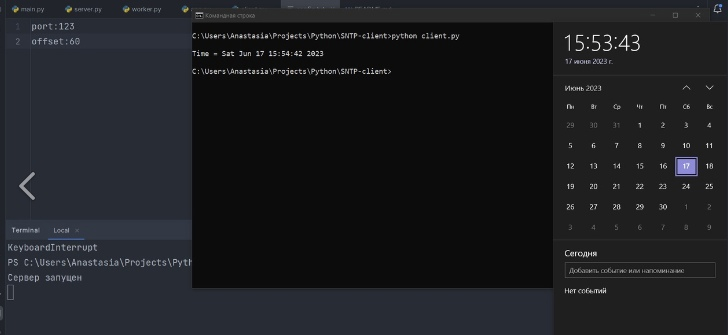

Сервер точного времени, который "врёт"
====================================================
Автор
--------------
Проект реализован студенткой группы КН-201 Новиковой Анастасией.

Описание
--------------
Программа на языке Python, которая реализует сервер точного времени. Сервер позволяет указывать заданное количество
секунд, на которое он "врет" или отстает от точного времени. Сервер прослушивает порт 123 по протоколу UDP и
может получать точное время от операционной системы. В конфигурационном файле можно указать прослушиваемый порт 
(по стандарту 123) и количество секунд, на которое сервер будет изменять текущее время.

Запуск сервера
--------------
 
Запустите сервер, выполнив следующую команду:
    
    `python main.py`

Вы увидите сообщение "Сервер запущен", которое указывает на успешный запуск сервера.
    

Использование сервера
---------------------
Сервер будет прослушивать порт 123 и ожидать входящих запросов от клиентов. Для запуска клиента введите следующую команду:

    `python client.py`

Принцип работы
--------------------- 
1. Сервер ожидает входящих запросов от клиента
2. При получении запроса сервер формирует ответ, изменяя время, после чего запаковывает его в байты и отправляет клиенту
3. Клиент получает набор байтов, которые ему нужно распаковать

Пример работы:
---------------------
Задержка еще на секунду обусловлена моей скорость открытия панели с временем после получения ответа от сервера
